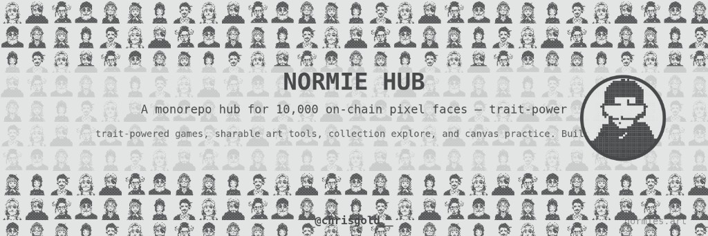

# Normies Hub

Live demo: [normieshub.vercel.app](https://normieshub.vercel.app/) · Built on the [Normies API](https://api.normies.art)

## Games

| Experience | Description |
|------------|-------------|
| **Normie Slingshot** | Angry Birds-style launcher — trait abilities smash pixel block fortresses |
| **Normie Run** | Temple Run endless runner — collect cards, export your pixel self |
| **Normie Penalty Shootout** | Solo scoring or AI shootout — traits affect curve, power, and dives |
| **Normies Defense** | Tower defense on 3 maps — place Normies, upgrade, survive 10 waves |
| **Normie Snake** | Classic snake — eat faces to grow your chain (mobile D-pad included) |
| **Normie Block Builder** | Tetris-style stacking — clear lines to collect Normies, export a poster |

## Tools

| Tool | Description |
|------|-------------|
| **Canvas Lab** | XOR simulator & burn preview — flip pixels, merge layers, estimate action points |
| **Find My Normie** | Photo or X profile → scan the collection for your closest pixel match |
| **Normie Me** | X profile, upload, or URL → 40×40 Normie pixel portrait |
| **Normie ID Card** | Official or personalised card with portrait, name, and tagline |
| **Squad Sheet** | Wallet holdings as a printable contact sheet |
| **Burn Memorial** | Commemorative card for burned Normies |
| **Normie Banner** | X headers & social cards — parade, spotlight, mosaic, collector flex |
| **Normie Circle** | Your pixel self at the center, ringed by random Normies |
| **Normies Playlist** | Ten Suno tracks — on-chain lore, canvas, burns, and the collective |
| **Collection Grid** | Browse all 10,000 Normies — filter, inspect, OpenSea listings |

## Setup

Requires [pnpm](https://pnpm.io/) 10+ and Node 20+.

```bash
pnpm install
cp .env.example apps/hub/.env   # optional: OpenSea listings in /explore
pnpm generate-traits            # quick fallback trait index (~1 min)
# or: pnpm fetch-traits         # full on-chain traits (slow)
pnpm --filter @normie/hub generate-audio   # only if public/audio/ is missing
pnpm dev
```

Open [http://localhost:5173](http://localhost:5173).

### Environment variables

Copy `.env.example` to `apps/hub/.env`:

| Variable | Required | Description |
|----------|----------|-------------|
| `OPENSEA_API_KEY` | No | Live listing badges on `/explore` ([OpenSea API](https://docs.opensea.io/reference/api-overview)) |
| `VITE_NORMIES_API_BASE` | No | Override Normies API base (default: `https://api.normies.art`) |

## Scripts

| Command | Description |
|---------|-------------|
| `pnpm dev` | Start hub dev server |
| `pnpm build` | Production build (`@normie/shared` + hub) |
| `pnpm typecheck` | Typecheck all packages |
| `pnpm fetch-traits` | Fetch all 10k traits from API into `apps/hub/public/traits-index.json` |
| `pnpm generate-traits` | Generate fallback trait index (fast) |
| `pnpm --filter @normie/hub generate-audio` | Generate WAV music/SFX in `apps/hub/public/audio/` |

## Project structure

```
apps/hub/          React + Vite frontend, Vercel serverless API helpers
packages/shared/   Shared pixel export utilities & constants
api/               Vercel serverless routes (listings, Normies proxy, X avatars)
scripts/           Trait fetch/generate scripts
docs/screenshots/  README showcase images (not served by the app)
```

## Deploy (Vercel)

Set **Root Directory** to `apps/hub` and enable **Include files outside the root directory**.

| Setting | Value |
|---------|--------|
| Root Directory | `apps/hub` |
| Output Directory | `dist` |
| Build Command | `cd ../.. && pnpm build` |
| Install Command | `cd ../.. && pnpm install` |

Paths are relative to `apps/hub` — do **not** set Output Directory to `apps/hub/dist`.

`apps/hub/vercel.json` mirrors these settings. API routes live in `apps/hub/api/`.

Set **`OPENSEA_API_KEY`** in Vercel project settings for live OpenSea listings on `/explore`.

**Live site:** [normieshub.vercel.app](https://normieshub.vercel.app/)

## Screenshots

Exportable PNGs and hub UI — generated in-browser from on-chain Normie pixels. Images live in [`docs/screenshots/`](docs/screenshots/).

### Hub & games

| | |
|---|---|
| **Hub** — games tab | **Normie Snake** — eat faces to grow your chain |
| 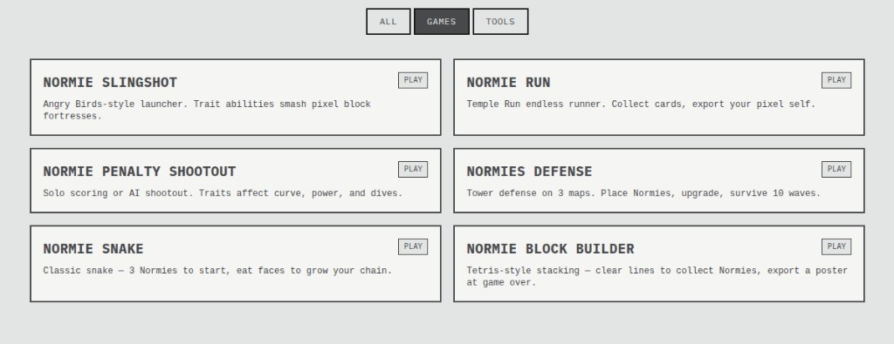 | 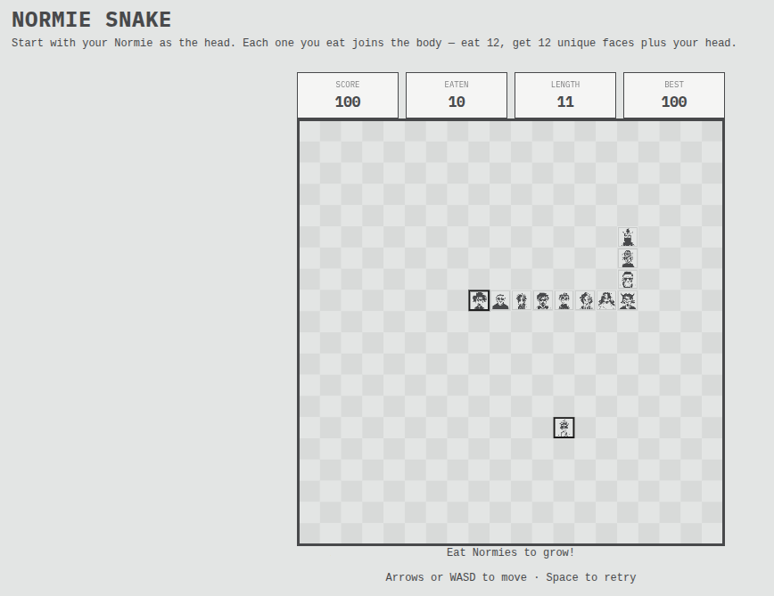 |
| **Normie Run** — score card with your pixel self and collected faces | **Block Builder** — poster after clearing lines |
| 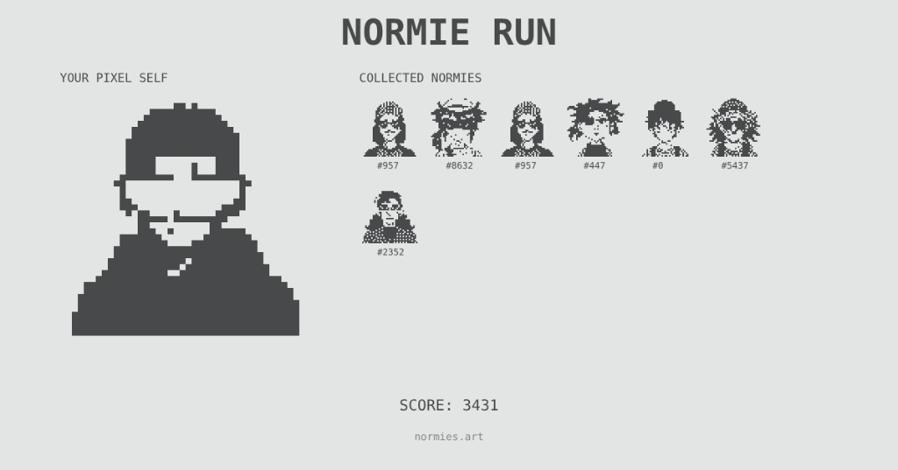 | 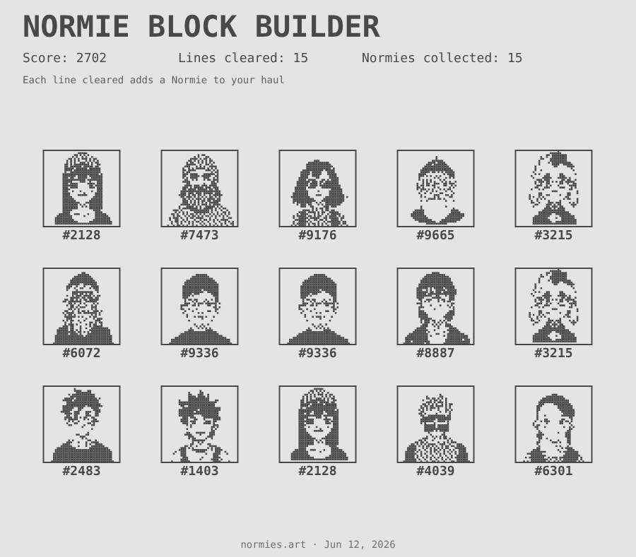 |
| **Block Builder** — another haul | |
| 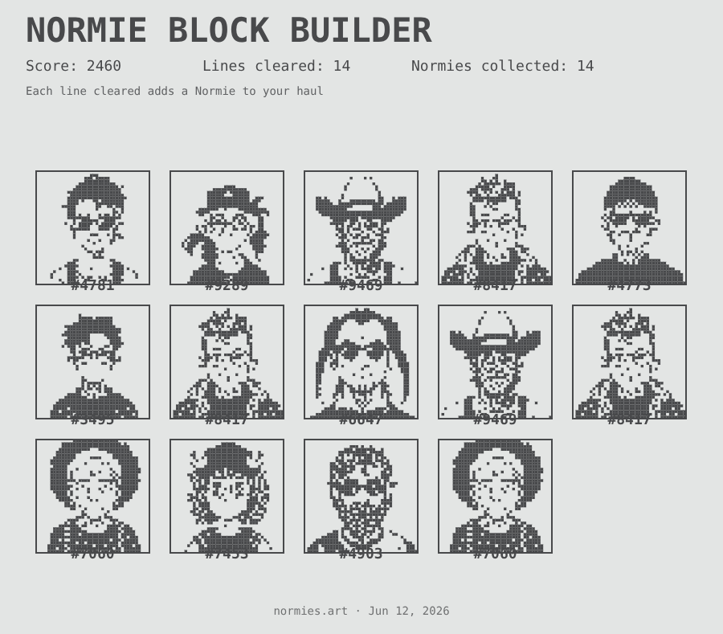 | |

### Tools & explore

| | |
|---|---|
| **Collection Grid** — browse all 10,000 Normies | **Normie Circle** — your pixel self ringed by Normies |
| 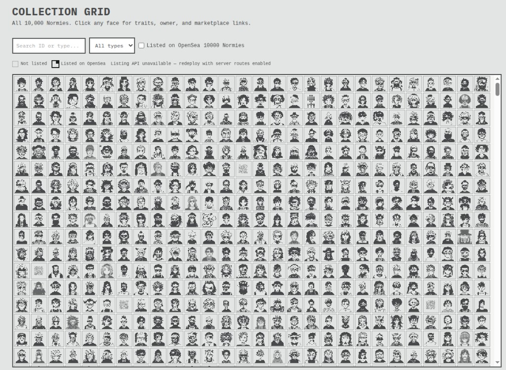 | 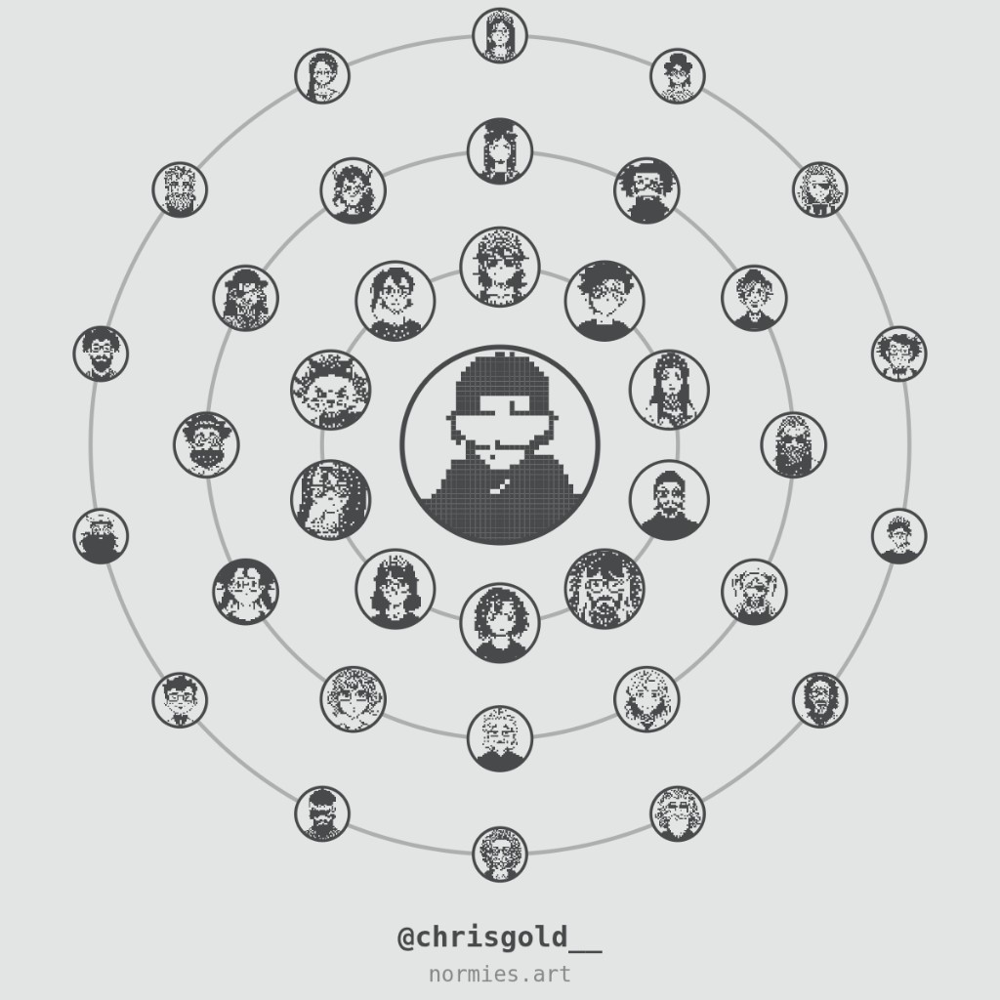 |
| **Canvas Lab** — XOR edit preview | **Squad Sheet** — wallet holdings contact sheet |
| 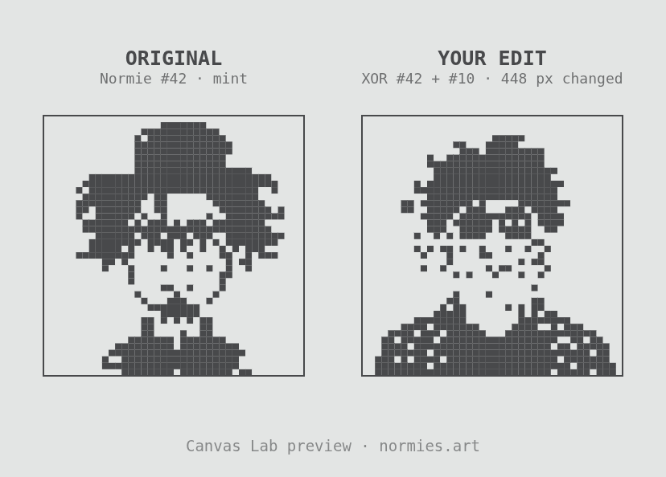 | 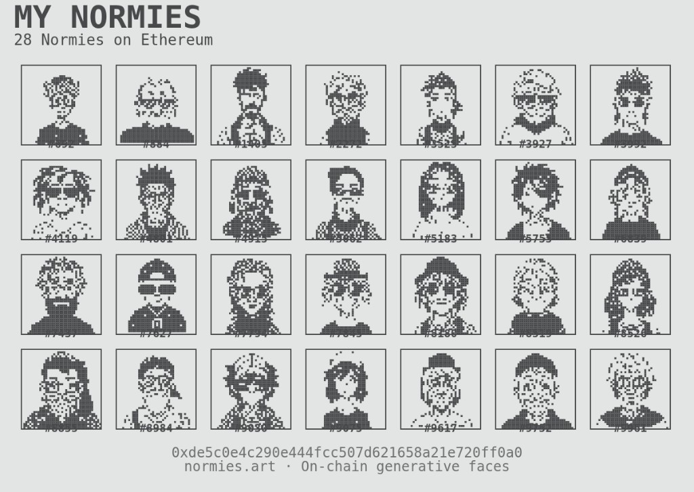 |
| **Burn Memorial** — commemorative burned Normie card | **Normie Banner** — X header export |
| 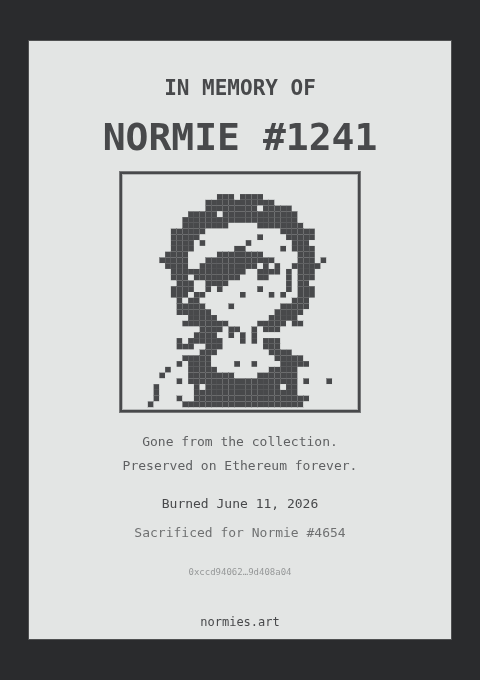 | 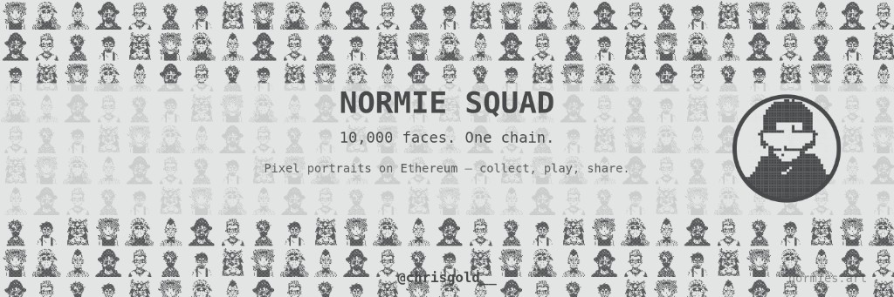 |

<details>
<summary>Canvas Lab — light edit (28 px changed)</summary>

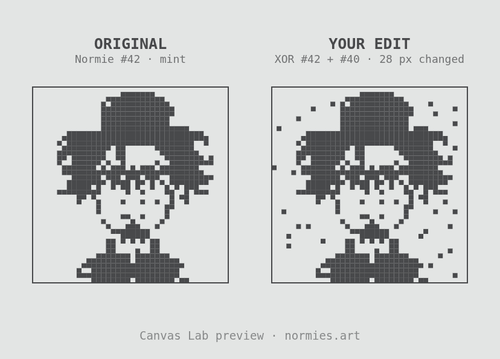

</details>

## Hackathon

Submit at [hackathon.normies.art](https://hackathon.normies.art/) — category **Game**.

## License

MIT
